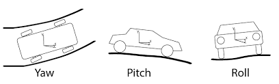

# Commaai's Calib-Challange
## Goal
the goal is to predict the direction of travel (in camera frame) from provided dashcam video. (yaw and pitch, fortunately, no roll)
  
[Commaai's](https://github.com/commaai/calib_challange) repo provides 10 videos. Every video is 1min long and 20 fps. 
5 videos are labelled with a 2D array describing the direction of travel at every frame of the video with a pitch and yaw angle in radians. 
5 videos are unlabeled. It is your task to generate the labels for them. 
The example labels are generated using a Neural Network, and the labels were confirmed with a SLAM algorithm. 
You can estimate the focal length to be 910 pixels. 
 

## Evaluation
They will evaluate our mean squared error against our ground truth labels. Errors for frames where the car speed is less than 4m/s will be ignored. Those are also labeled as NaN in the example labels.
  
commaai's repo includes an eval script that will give an error score (lower is better). You can use it to test your solutions against the labeled examples. They will use this script to evaluate your solution.

## Architecture 
I am thinking of using some kind of optical flow model and rather than doing some kind of image stabilization or something I'll make it yield Yaw and Pitch of the moving vehicle.
  
Adding details about the architecture soon!
### 1. FlowNetCorr
[reseach paper](https://arxiv.org/pdf/1504.06852.pdf)
adding details soon !
### 2. Global Motion Aggregation
### 3. MarkFlowNet and FlowNet2.0 --> no implimentation 

## Navigation
[Labelled dataset](./labeled) 
[Unlabeled test dataset](./unlabeled) 
[Eval script](eval.py) 
[Models and training script](./calib) 
[Setup](setup.py)  

## ToDo
- [x] Visualizing the data
- [ ] MaskFlow net
- [x] FlowNet corr
- [ ] Gma
- [ ] Training the model
- [ ] SLAM
- [ ] Write utility functions
- [ ] Build and Deploy
- [ ] Update README

## example of how opensource is changing the world !! 
[comma ai](https://github.com/commaai)
